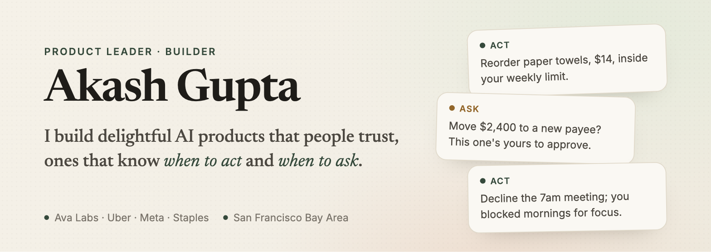

# Hi, I'm Akash 👋

15+ years building products at Ava Labs, Uber, Meta, and Staples. Engineer first, founder once.

[LinkedIn](https://www.linkedin.com/in/akash90gupta/) • [X](https://x.com/akash90gupta) • [Email](mailto:akash90gupta@gmail.com)

---

## Thesis

AI agents are getting the keys to our inboxes, calendars, and bank accounts.

The ones that win won't be the smartest.

They'll be the ones that know when to act, and when to ask.

---

## Current Focus

### 🤖 Autonomous Agents that can act safely

Judgment, permissions, and knowing which actions can't be undone.

### 💸 Money & Commerce

Wallets, payments, and stablecoins, where a wrong move costs a real person.

### 📈 Growth & Experimentation

Personalization and lifecycle systems where small lifts become very large numbers.

---

## Projects

### 📰 [Enough.ai](https://akash90gupta.github.io/enough.ai/): AI news, finished

Every morning it tells you what actually changed at Anthropic, Google, Meta, OpenAI and xAI, then it ends. Claude writes it, code checks every source, and it updates itself daily. [Code](https://github.com/akash90gupta/enough.ai)

---

## Career Milestones

- **Ava Labs:** Built Core from 0 to **1M+ users** and **6B+ onchain transactions**; shipped an LLM wallet assistant (**+15% completion**)
- **Uber:** Led the Growth Platform for 100M+ users; **$350M+ incremental bookings**, 50% above goal
- **Meta:** Launched Blueprint to **5M+ advertisers**; personalized learning lifted ad spend **~20%**
- **Staples:** Engineer turned PM; rebuilt Staples.com for **~10% higher conversion** and **$3M+ annual savings**
- **Founder:** Built and sold Brisk, bookings and CRM for small businesses

---

## Principles

- Earn trust before adding { AI } magic
- Products must better the more people use it
- Use AI where it changes the experience, not as a bolt-on

